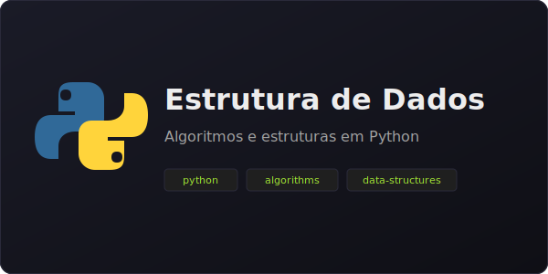

<h1 align="center">
  
</h1>

  
  
  

---

### 👋 Sobre mim

Sou estudante de **Sistemas de Informação** e desenvolvedor full-stack em formação. Gosto de construir APIs bem desenhadas, interfaces limpas e código que outras pessoas conseguam ler sem sofrer.

> Atualmente estudando **TypeScript avançado**, **arquitetura de APIs** e padrões de projeto aplicados ao back-end Node.js.

<b>🇺🇸 English</b>

I'm an Information Systems student and a full-stack developer in training. I enjoy building well-designed APIs, clean interfaces, and code other people can actually read without suffering.

> Currently studying **advanced TypeScript**, **API architecture**, and design patterns applied to Node.js back-ends.

---

### 🛠️ Tech Stack

**Front-end**

  
  
  
  
  

**Back-end**

  
  
  
  

**Banco & Ferramentas**

  
  
  
  
  

---

### 🚀 Projetos em destaque · Featured projects

<table>
  <tr>
    <td width="50%" valign="top">
      <h3 align="center">🎯 Gfocus</h3>
      

        
      

      

        App de produtividade — lista de tarefas com drag & drop e filtros inteligentes.
      

      

        <a href="https://gfocus-zeta.vercel.app"><b>🌐 Demo</b></a> ·
        <a href="https://github.com/guuszz/Gfocus"><b>Código</b></a>
      

    </td>
    <td width="50%" valign="top">
      <h3 align="center">🏋️ Academia em Casa</h3>
      

        
      

      

        App mobile (React Native + Expo) para treinos em casa com peso do corpo.
      

      

        <a href="https://fithome-alpha.vercel.app"><b>🌐 Demo</b></a> ·
        <a href="https://github.com/guuszz/Academia-Em-Casa"><b>Código</b></a>
      

    </td>
  </tr>
  <tr>
    <td width="50%" valign="top">
      <h3 align="center">🔧 Oficina Mecânica</h3>
      

        
      

      

        Sistema full-stack para gestão de oficina — API REST + interface web.
      

      

        <a href="https://oficina-rouge.vercel.app"><b>🌐 Demo</b></a> ·
        <a href="https://github.com/guuszz/OFICINA"><b>Código</b></a>
      

    </td>
    <td width="50%" valign="top">
      <h3 align="center">📚 Estrutura de Dados</h3>
      

        
      

      

        Exercícios e implementações de estruturas de dados clássicas em Python.
      

      

        <a href="https://github.com/guuszz/atividade-estrutura-de-dados"><b>Código</b></a>
      

    </td>
  </tr>
</table>

---

### 📊 GitHub em números · GitHub at a glance

  
  

  

  

  

---

### 🌱 Em que estou trabalhando · What I'm up to

- 🔭 Construindo APIs REST mais robustas com **Node.js + TypeScript**
- 📚 Estudando **arquitetura limpa** e **testes automatizados**
- 🤝 Aberto a colaborar em projetos open-source
- 💬 Pergunte-me sobre **JavaScript, Node, MySQL** — adoro trocar ideia sobre código

<b>🇺🇸 English</b>

- 🔭 Building more robust REST APIs with **Node.js + TypeScript**
- 📚 Studying **clean architecture** and **automated testing**
- 🤝 Open to collaborating on open-source projects
- 💬 Ask me about **JavaScript, Node, MySQL** — happy to chat about code

---

  Feito com ☕ em Vitória da Conquista — BA

