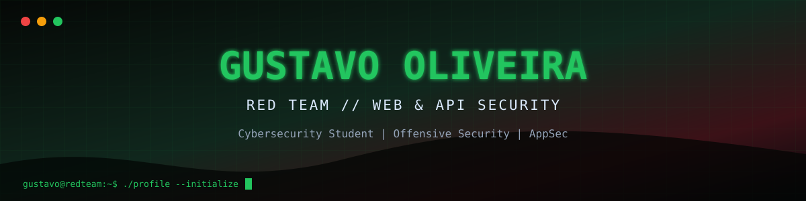
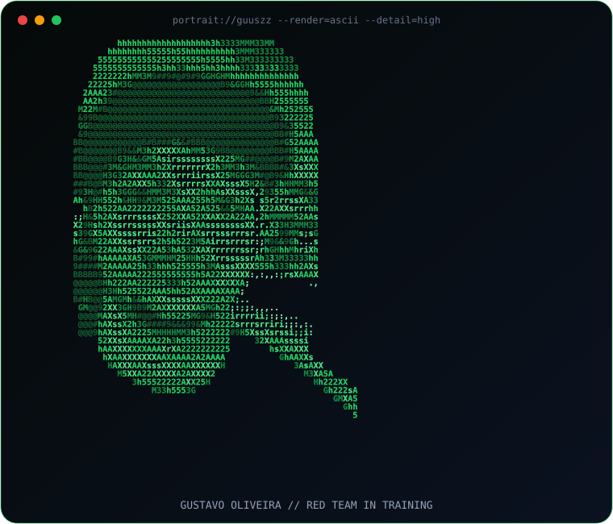
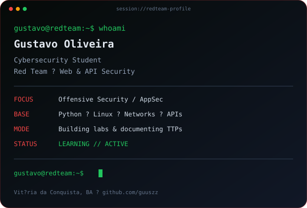
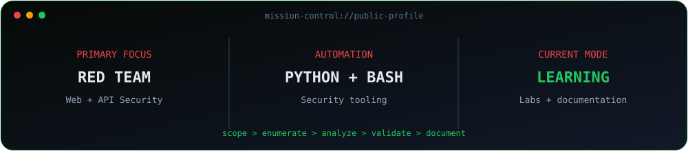

<!-- Profile design inspired by terminal interfaces and offensive-security dashboards. -->

<div align="center">




[](https://www.linkedin.com/in/gustavo-saraiva-054807358/)
[](https://portfolio-amber-omega-3kyqfla4q7.vercel.app)
[](mailto:gustavosaraiva2504@gmail.com)

</div>

<div align="center">
<table>
<tr>
<td width="55%" valign="middle"></td>
<td width="45%" valign="middle"></td>
</tr>
</table>
</div>

---

```bash
gustavo@redteam:~$ cat identity.yaml
```

```yaml
identity:
  name: "Gustavo Oliveira"
  location: "Vitória da Conquista, BA — Brasil"
  education: "Sistemas de Informação"
  status: "Cybersecurity student / Red Team em formação"

focus:
  - "Web Application Security"
  - "API Security"
  - "Reconnaissance and Enumeration"
  - "Security Automation"

foundation:
  - "Full-stack development"
  - "HTTP, APIs and authentication"
  - "Linux and computer networks"
  - "Python, Bash and TypeScript"
```

Minha experiência com desenvolvimento me ajuda a enxergar aplicações por dentro: rotas, autenticação, lógica de negócio, bancos de dados e integrações. Estou direcionando essa base para **segurança ofensiva**, praticando em laboratórios e transformando cada estudo em documentação reproduzível.

---

## `./arsenal --list`

<div align="center">

### Offensive Security


### Automation & Development


### Infrastructure & Data


</div>

---

## `./operations --current`

| Projeto | Missão | Status |
|---|---|---|
| [**ScopeGuard**](https://github.com/guuszz/scopeguard) | Validar e normalizar escopos antes da execução de ferramentas de segurança | `v0.1.0 · ACTIVE` |
| [**RedReport**](https://github.com/guuszz/redreport) | Transformar findings YAML validados em relatórios técnicos Markdown e HTML | `v0.1.0 · ACTIVE` |
| [**estudo-redes**](https://github.com/guuszz/estudo-redes) | Consolidar TCP/IP, DNS, HTTP e análise de tráfego para segurança ofensiva | `ACTIVE` |
| [**Security PR Reviewer**](https://github.com/guuszz/pr-reviewer) | Revisar diffs com regras AppSec determinísticas, evidência por linha e mapeamento CWE/OWASP | `v0.2.0 · ACTIVE` |
| [**OFICINA**](https://github.com/guuszz/OFICINA) | Usar uma aplicação full-stack para estudar superfície de ataque e desenvolvimento seguro | `LAB BASE` |
| **Red Team Lab** | Organizar exercícios, metodologia, evidências e relatórios de ambientes locais | `PREPARING` |

> Conteúdos públicos de segurança são baseados em ambientes próprios, CTFs e laboratórios preparados para estudo.

---

## `./roadmap --track red-team`

- [x] Fundamentos de desenvolvimento Web e APIs
- [x] Git/GitHub e automação básica
- [x] Fundamentos de redes
- [x] Publicar uma ferramenta própria para workflows de segurança
- [ ] Publicar write-ups de laboratórios e CTFs
- [ ] Criar automações de reconhecimento e coleta de evidências
- [ ] Documentar uma metodologia de pentest Web/API
- [ ] Aprofundar Linux e privilege escalation
- [ ] Construir laboratório de Active Directory
- [ ] Mapear estudos e técnicas ao MITRE ATT&CK

---

## `./metrics --public`

<div align="center">



<br>


</div>

---

<div align="center">

`scope → enumerate → analyze → validate → document`


</div>
